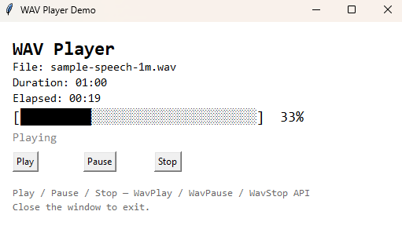

# Python Small Basic

[](LICENSE)
[](https://www.python.org/)
[]()

A Python library that mirrors the [Microsoft Small Basic](https://smallbasic-publicwebsite.azurewebsites.net/) API, making it easy for beginners — especially kids — to learn programming with a familiar, friendly interface. Everything runs using **Python's standard library only** (no external dependencies).

> **Platform:** Windows only (uses `tkinter` for GUI, `winsound` for Sound, `ctypes` for system info).

---

## Table of Contents

- [What is it?](#what-is-it)
- [Connection to Microsoft Small Basic](#connection-to-microsoft-small-basic)
- [What It Can Do](#what-it-can-do)
- [What It Cannot Do (Yet)](#what-it-cannot-do-yet)
- [Installation](#installation)
- [Quick Start](#quick-start)
- [Demos](#demos)
- [API Overview](#api-overview)
- [Differences from Microsoft Small Basic](#differences-from-microsoft-small-basic)
- [Changelog](#changelog)
- [License](#license)
- [Contributing](#contributing)

---

## What is it?

Python Small Basic is a **faithful re-implementation** of the Microsoft Small Basic API in Python. It replaces the original `.exe`-based environment with standard Python, giving you:

- Full **Python syntax** and capabilities underneath
- **Type hints** and **docstrings** on every function for IDE autocomplete
- **Familiar Small Basic object names** (`TextWindow`, `GraphicsWindow`, `Turtle`, `Controls`, etc.)
- Educational simplicity for teaching programming concepts

## Connection to Microsoft Small Basic

[Microsoft Small Basic](https://smallbasic-publicwebsite.azurewebsites.net/) is a simplified programming language designed by Microsoft for beginners (ages 8–16). It uses an intentionally tiny API with objects like `TextWindow`, `GraphicsWindow`, `Turtle`, etc., to let kids create text-based programs, graphics, and games.

**Python Small Basic** is *not* a clone of the Small Basic language/compiler. Instead, it is an **API-compatible library** for Python 3 that lets you write Python code using the same object names and method signatures that Small Basic users already know. The goal is to let educators teach programming concepts in Small Basic first, then transition to Python without having to learn a completely new set of commands.

For example, in Microsoft Small Basic you'd write:

```
TextWindow.WriteLine("Hello World")
```

In Python Small Basic you write exactly the same thing:

```python
from smallbasic import TextWindow
TextWindow.WriteLine("Hello World")
```

## What It Can Do

| Object        | Capabilities                                                                 |
|---------------|------------------------------------------------------------------------------|
| **TextWindow**  | Console-style text output with colors, input (Read, ReadNumber), pause      |
| **GraphicsWindow** | Drawing shapes (rectangles, ellipses, triangles, lines, text), colors, window controls |
| **Turtle**       | Logo-style turtle graphics with Move, Turn, PenUp/PenDown, Speed, Show/Hide |
| **Controls**     | Real tkinter widgets: Button, TextBox, MultiLine Text                       |
| **Mouse**        | Get cursor position relative to the screen, button state detection          |
| **Shapes**       | Animate, move, rotate, zoom shapes on the GraphicsWindow canvas             |
| **Sound**        | Play tones/melodies (via `winsound`), pause/resume support                  |
| **Clock**        | Current date, time, weekday, milliseconds                                   |
| **Timer**        | Interval-based event callbacks with pause/resume                            |
| **Network**      | HTTP GET, POST, PUT, DELETE, PATCH, JSON, file downloads                    |
| **File**         | Read, write, append, copy, delete text files and directories                |
| **Desktop**      | Screen dimensions, wallpaper setting                                        |
| **Math**         | Trigonometry, random numbers, min/max/sum/average (with `*args`), rounding |
| **Dictionary**   | Online word definitions and translations (English to 8+ languages)          |
| **Array**        | Indexed list operations                                                     |
| **Stack**        | Push/pop operations                                                         |
| **Program**      | Program.Delay, Program.End, argument access                                 |
| **ImageList**    | Load and retrieve images (uses PIL if available, else tkinter's built-in)   |
| **Text**         | Append, convert to/from uppercase, get length, get substring                 |

### Key Features

- **Real tkinter widgets** – Buttons, TextBoxes, and MultiLine text are actual tkinter GUI widgets (not just stored models).
- **Color support** – Named colors + `GetColorFromRGB(r, g, b)` + `GetRandomColor()`.
- **Fun with arguments** – `Math.Max(1, 2, 3, 4, 5)` (variadic `*args`), `TextWindow.WriteLine("a", "b", "c")`.
- **Event-driven** – `KeyDown`, `KeyUp`, `MouseDown`, `MouseUp`, `MouseMove`, `ButtonClicked`, `Timer.Tick`.
- **Full type hints** – Every function/method has typed parameters, return annotations, and docstrings.
- **Shape rotation** – Proper 2D rotation using rotation matrices.
- **Sound pause/resume** – Pause and resume audio playback.
- **Translation support** – Dictionary methods that actually translate words using the MyMemory API.

## What It Cannot Do (Yet)

- **Flickr** – The original Small Basic `Flickr` object is omitted because the Flickr API requires an API key and OAuth. No replacement is provided.
- **ImageList.LoadImage** – Works with PIL (Pillow) if installed, or with tkinter's `.gif`/`.ppm` support only. Full image format support requires `pip install Pillow`.
- **GraphicsWindow.MakeKeyFromTitle** / **GraphicsWindow.MakeKeyFromVisible** – Not implemented.
- **Controls events** – `Controls.KeyTyped` is not implemented due to focus management complexity with real widgets.
- **Multi-touch** – Not supported; only single mouse cursor.
- **Linux/macOS** – This library is Windows-only (uses `winsound`, `ctypes` Windows APIs). Contributions for cross-platform support welcome.

## Installation

### Option 1: Install directly

```bash
pip install python-smallbasic
```

### Option 2: From source

```bash
git clone https://github.com/incredibleamir-dot/PythonBasic.git
cd PythonBasic
pip install -e .
```

### Option 3: Just copy the package

Copy the `smallbasic/` folder into your project directory. All dependencies are in the Python standard library — no `pip install` required.

### Optional: Image support

```bash
pip install Pillow
```

Without Pillow, `ImageList.LoadImage` only supports `.gif` and `.ppm` files (via tkinter's built-in PhotoImage).

### Requirements

- **Python 3.10+**
- **Windows** (7, 10, 11)
- No external packages required

## Quick Start

```python
from smallbasic import *

# --- Hello World ---
TextWindow.Title = "My Program"
TextWindow.ForegroundColor = "Cyan"
TextWindow.WriteLine("Hello, World!")
TextWindow.WriteLine("Welcome to Python Small Basic!")

# --- Draw some shapes ---
GraphicsWindow.Title = "Shapes"
GraphicsWindow.Width = 400
GraphicsWindow.Height = 300
GraphicsWindow.BackgroundColor = "White"
GraphicsWindow.Show()

GraphicsWindow.BrushColor = "Red"
GraphicsWindow.FillEllipse(10, 10, 50, 50)

# --- Rotate a shape ---
rect = Shapes.AddRectangle(100, 50)
Shapes.Rotate(rect, 45)  # Properly rotates the shape

# --- Turtle ---
Turtle.Show()
Turtle.Move(100)
Turtle.Turn(90)
Turtle.Move(50)

# --- Keyboard / Mouse events ---
def on_key(event):
    TextWindow.WriteLine(f"Key pressed: {event.keysym}")

GraphicsWindow.KeyDown = on_key

def on_click(event):
    TextWindow.WriteLine(f"Mouse at ({event.x}, {event.y})")

GraphicsWindow.MouseDown = on_click

# --- Sound with pause/resume ---
Sound.Play("C:/music/track.wav")
Program.Delay(2000)
Sound.Pause()
Program.Delay(1000)
Sound.Resume()

# --- Dictionary ---
definition = Dictionary.GetDefinition("hello")
TextWindow.WriteLine(definition)

spanish = Dictionary.GetDefinitionEnglishToSpanish("hello")
TextWindow.WriteLine(f"Spanish: {spanish}")
```

## Demos

The `demos/` folder contains 11 runnable examples covering all features:

| # | File | Description |
|---|------|-------------|
| 1 | `01_hello_world.py` | TextWindow basics, colors, input |
| 2 | `02_text_window_io.py` | Colors, cursor, ReadNumber, varargs |
| 3 | `03_math_fun.py` | Trig, random, sum/average/min/max with *args |
| 4 | `04_graphics_shapes.py` | Rectangles, ellipses, triangles, lines, text |
| 5 | `05_turtle_drawing.py` | Turtle square, triangle, star, spiral |
| 6 | `06_controls_gui.py` | TextBox, Button, MultiLine Text |
| 7 | `07_network_rest.py` | HTTP GET, JSON, GetWebPageContents |
| 8 | `08_file_operations.py` | Read/write/append text files |
| 9 | `09_clock_timer.py` | Clock time/date + Timer events |
| 10 | `10_all_features.py` | Mouse drawing + keyboard events + controls |
| 11 | `11_loops_conditions_functions.py` | For/while loops, if/else, functions |

Run any demo with:

```bash
python demos/04_graphics_shapes.py
```

## API Overview

### TextWindow

| Method / Property | Description |
|---|---|
| `WriteLine(...)` | Write text with newline; accepts multiple args |
| `Write(...)` | Write text without newline |
| `Read()` | Read a line of text |
| `ReadNumber()` | Read a number |
| `ReadKey()` | Read a single key press |
| `Pause()` | Wait for ENTER key |
| `Clear()` | Clear the window |
| `ForegroundColor` | Text color (named) |
| `BackgroundColor` | Background color |
| `Title` | Window title |
| `Left`, `Top` | Window position |
| `Show()`, `Hide()` | Show / hide window |

### GraphicsWindow

| Method / Property | Description |
|---|---|
| `Show()` | Display the window |
| `Hide()` | Hide the window |
| `Wait()` | Keep the window open until closed |
| `Clear()` | Clear canvas |
| `DrawRectangle(x, y, w, h)` | Outline rectangle |
| `FillRectangle(x, y, w, h)` | Filled rectangle |
| `DrawEllipse(x, y, w, h)` | Outline ellipse |
| `FillEllipse(x, y, w, h)` | Filled ellipse |
| `DrawTriangle(x1,y1, x2,y2, x3,y3)` | Outline triangle |
| `FillTriangle(x1,y1, x2,y2, x3,y3)` | Filled triangle |
| `DrawLine(x1, y1, x2, y2)` | Line |
| `DrawText(x, y, text)` | Text |
| `DrawBoundText(x, y, width, text)` | Word-wrapped text |
| `DrawImage(name, x, y)` | Draw an image |
| `DrawResizedImage(name, x, y, w, h)` | Draw a resized image |
| `SetPixel(x, y, color)` | Set a single pixel |
| `GetPixel(x, y)` | Get color at coordinates |
| `GetColorFromRGB(r, g, b)` | Create color string |
| `GetRandomColor()` | Random color string |
| `ShowMessage(text, title)` | Show a message box |
| `Width`, `Height` | Window size |
| `Left`, `Top` | Window position |
| `BrushColor`, `PenColor`, `PenWidth` | Drawing state |
| `FontName`, `FontSize`, `FontBold`, `FontItalic` | Font state |
| `BackgroundColor` | Canvas background |
| `Title` | Window caption |
| `CanResize` | Allow window resizing |
| `KeyDown`, `KeyUp`, `MouseDown`, `MouseUp`, `MouseMove`, `TextInput` | Events |
| `LastKey`, `LastText` | Latest keyboard input |
| `MouseX`, `MouseY` | Mouse position (relative to canvas) |

### Controls

| Method / Property | Description |
|---|---|
| `AddButton(caption, x, y)` | Create a Button widget |
| `AddTextBox(x, y)` | Create a single-line TextBox |
| `AddMultiLineTextBox(x, y)` | Create a multi-line Text widget |
| `AddMultiLineText(x, y)` | Alias for AddMultiLineTextBox |
| `SetTextBoxText(id, text)` | Set text content |
| `GetTextBoxText(id)` | Get text content |
| `SetButtonCaption(id, text)` | Set button label |
| `GetButtonCaption(id)` | Get button label |
| `SetSize(id, w, h)` | Resize a control |
| `Move(id, x, y)` | Reposition a control |
| `HideControl(id)` | Hide a control |
| `ShowControl(id)` | Show a hidden control |
| `Remove(id)` | Remove a control |
| `ButtonClicked` | Event: button clicked |
| `TextTyped` | Event: text typed in textbox |
| `LastClickedButton` | Name of last clicked button |
| `LastTypedTextBox` | Name of last typed textbox |

### Turtle

| Method / Property | Description |
|---|---|
| `Show()` | Show turtle cursor |
| `Hide()` | Hide turtle cursor |
| `Move(distance)` | Move forward |
| `Turn(angle)` | Turn right (degrees) |
| `TurnLeft()` | Turn left 90 degrees |
| `TurnRight()` | Turn right 90 degrees |
| `MoveTo(x, y)` | Move to absolute position |
| `PenDown()` | Start drawing |
| `PenUp()` | Stop drawing |
| `Speed` | Animation speed (1-10) |
| `Angle` | Current heading |
| `X`, `Y` | Current position |

### Shapes

| Method | Description |
|---|---|
| `AddRectangle(w, h)` | Create rectangle shape |
| `AddEllipse(w, h)` | Create ellipse shape |
| `AddTriangle(x1,y1,x2,y2,x3,y3)` | Create triangle shape |
| `AddLine(x1,y1,x2,y2)` | Create line shape |
| `AddImage(name)` | Add image shape |
| `AddText(text)` | Add text shape |
| `Move(id, x, y)` | Move shape to position |
| `Rotate(id, angle)` | Rotate shape (degrees) |
| `Zoom(id, sx, sy)` | Scale shape |
| `Animate(id, x, y, duration)` | Smooth animation |
| `Remove(id)` | Delete shape |
| `SetText(id, text)` | Set text on shape |
| `HideShape(id)` | Hide a shape |
| `ShowShape(id)` | Show a shape |
| `GetLeft(id)` | Get x position |
| `GetTop(id)` | Get y position |
| `GetOpacity(id)` | Get opacity level |
| `SetOpacity(id, level)` | Set opacity (0-100) |

### Math

| Method | Description |
|---|---|
| `Sin(deg)`, `Cos(deg)`, `Tan(deg)` | Trigonometry (degrees) |
| `ArcSin(v)`, `ArcCos(v)`, `ArcTan(v)` | Inverse trig (returns degrees) |
| `Floor(n)`, `Ceiling(n)`, `Round(n)` | Rounding |
| `Abs(n)` | Absolute value |
| `Max(*args)` | Maximum (variadic) |
| `Min(*args)` | Minimum (variadic) |
| `Sum(*args)` | Sum (variadic) |
| `Average(*args)` | Average (variadic) |
| `GetRandomNumber(max)` | Random integer 1..max |
| `Remainder(a, b)` | Modulo |
| `SquareRoot(n)` | Square root |
| `Power(base, exp)` | Exponentiation |
| `NaturalLog(n)` | Natural logarithm |
| `Log(n)` | Base-10 logarithm |
| `GetDegrees(rad)` | Radians to degrees |
| `GetRadians(deg)` | Degrees to radians |
| `Pi` | Constant (3.14159...) |

### Network

| Method | Description |
|---|---|
| `Get(url, headers, params)` | HTTP GET (returns response) |
| `Post(url, data, headers, as_json)` | HTTP POST |
| `Put(url, data, headers, as_json)` | HTTP PUT |
| `Delete(url, headers)` | HTTP DELETE |
| `Patch(url, data, headers, as_json)` | HTTP PATCH |
| `GetWebPageContents(url)` | Download raw text |
| `DownloadFile(url)` | Download file to temp directory |

### Dictionary

| Method | Description |
|---|---|
| `GetDefinition(word)` | Get English definition |
| `GetDefinitionEnglishToEnglish(word)` | Get English definition |
| `GetDefinitionEnglishToGerman(word)` | Translate to German |
| `GetDefinitionEnglishToFrench(word)` | Translate to French |
| `GetDefinitionEnglishToSpanish(word)` | Translate to Spanish |
| `GetDefinitionEnglishToItalian(word)` | Translate to Italian |
| `GetDefinitionEnglishToJapanese(word)` | Translate to Japanese |
| `GetDefinitionEnglishToKorean(word)` | Translate to Korean |
| `GetDefinitionEnglishToSimplifiedChinese(word)` | Translate to Simplified Chinese |
| `GetDefinitionEnglishToTraditionalChinese(word)` | Translate to Traditional Chinese |

### Sound

| Method | Description |
|---|---|
| `Play(file_path)` | Play audio file (async) |
| `PlayAndWait(file_path)` | Play audio file and wait for completion |
| `PlayClick()` | Play system click sound |
| `PlayClickAndWait()` | Play click and wait |
| `PlayChime()` | Play system chime sound |
| `PlayChimeAndWait()` | Play chime and wait |
| `PlayChimes()` | Play system chimes sound |
| `PlayChimesAndWait()` | Play chimes and wait |
| `PlayBellRing()` | Play system bell ring |
| `PlayBellRingAndWait()` | Play bell ring and wait |
| `PlayMusic(notes)` | Play musical notes |
| `Pause()` | Pause current playback |
| `Resume()` | Resume paused playback |
| `Stop()` | Stop current playback |
| `WavFile` (property) | Get/set WAV file path; loads header metadata on set |
| `WavDuration` (property) | Total duration of loaded WAV in seconds (read-only) |
| `PlayPosition` (property) | Current playback position in seconds (read-only) |
| `WavPlay()` | Play WAV from beginning or resume from pause |
| `WavPause()` | Pause WAV playback, saves position |
| `WavStop()` | Stop WAV playback, reset position to 0 |
| `WavPlayAndWait()` | Play WAV synchronously (blocking) |

### More Objects

- **Clock** – `Time`, `Date`, `Year`, `Month`, `Day`, `WeekDay`, `Hour`, `Minute`, `Second`, `Millisecond`, `ElapsedMilliseconds`
- **Timer** – `Interval`, `Tick` (event), `Pause()`, `Resume()`
- **File** – `ReadContents(path)`, `WriteContents(path, text)`, `AppendContents(path, text)`, `ReadLine(path, line)`, `WriteLine(path, line, text)`, `InsertLine(path, line, text)`, `CopyFile(src, dst)`, `DeleteFile(path)`, `CreateDirectory(path)`, `DeleteDirectory(path)`, `GetFiles(path)`, `GetDirectories(path)`, `GetTemporaryFilePath()`, `GetSettingsFilePath()`
- **Desktop** – `Width`, `Height`, `SetWallPaper(path)`
- **Mouse** – `MouseX`, `MouseY` (screen coordinates), `IsLeftButtonDown`, `IsRightButtonDown`, `HideCursor()`, `ShowCursor()`
- **Array** – `SetValue(name, index, value)`, `GetValue(name, index)`, `ContainsIndex(name, index)`, `ContainsValue(name, value)`, `GetItemCount(name)`, `IsArray(value)`, `GetAllIndices(name)`, `RemoveValue(name, index)`
- **Stack** – `PushValue(name, value)`, `PopValue(name)`, `GetCount(name)`
- **Program** – `Delay(ms)`, `End()`, `GetArgument(index)`, `ArgumentCount`, `Directory`
- **ImageList** – `LoadImage(path)`, `GetWidthOfImage(name)`, `GetHeightOfImage(name)`
- **Text** – `GetLength(text)`, `Append(t1, t2)`, `GetSubText(text, start, length)`, `GetSubTextToEnd(text, start)`, `IsSubText(text, sub)`, `EndsWith(text, sub)`, `StartsWith(text, sub)`, `GetIndexOf(text, sub)`, `ConvertToUpperCase(text)`, `ConvertToLowerCase(text)`, `GetCharacter(code)`, `GetCharacterCode(char)`

## Differences from Microsoft Small Basic

| Aspect | Microsoft Small Basic | Python Small Basic |
|---|---|---|
| Language | Small Basic (custom BASIC-like) | Python 3 |
| Syntax | `x = 5` (no types) | `x = 5` (dynamic but Python) |
| Conditional | `If...Then...EndIf` | `if...else` (Python) |
| Loop | `For i = 1 To 10` | `for i in range(1, 11)` |
| Function | `Sub ... EndSub` | `def ...` |
| Error handling | None (just stops) | Python exceptions |
| Graphics | Built-in renderer | `tkinter.Canvas` |
| Sound | Built-in audio | `winsound` |
| Libraries | Limited built-in only | Full Python ecosystem |
| IDE | Custom IDE with IntelliSense | Any Python IDE (VS Code, PyCharm) |
| Platform | Windows | Windows only (currently) |
| Image support | Built-in | Requires Pillow for most formats |
| Flickr | Included | Omitted (needs API key) |
| Events | `GraphicsWindow.MouseDown = OnMouseDown` | Same syntax (Python callbacks) |
| Object model | Properties assignment | Metaclass + properties |
| Shape rotation | Built-in | 2D rotation matrix |
| Translation | Built-in | MyMemory API |

## Demos

The `demos/` folder contains example scripts demonstrating every feature.

| Demo | File | Description |
|------|------|-------------|
| 1 | `01_hello_world.py` | Basic TextWindow output and input |
| 2 | `02_text_window_io.py` | TextWindow colors, cursor, ReadKey |
| 3 | `03_math_fun.py` | Math operations, random numbers |
| 4 | `04_graphics_shapes.py` | GraphicsWindow drawing + Shapes |
| 5 | `05_turtle_drawing.py` | Turtle graphics demo |
| 6 | `06_controls_gui.py` | Buttons, text boxes, events |
| 7 | `07_network_rest.py` | REST API GET/POST requests |
| 8 | `08_file_operations.py` | File read/write/manage |
| 9 | `09_clock_timer.py` | Clock + Timer with callbacks |
| 10 | `10_all_features.py` | Quick tour of all objects |
| 11 | `11_loops_conditions_functions.py` | Python control flow demos |
| 12 | `12_fractal_tree.py` | Recursive fractal tree with Turtle |
| 13 | `13_wav_player.py` | WAV player with Play/Pause/Stop, progress & elapsed time |
| 14 | `14_mouse_coords.py` | Live mouse X/Y display via MouseMove event |



```bash
# Run any demo:
python demos/13_wav_player.py
```

## Changelog

See [CHANGELOG.md](CHANGELOG.md) for the full changelog.

## License

This project is licensed under the **MIT License** – see [LICENSE](LICENSE) for details.

You are free to:
- Use it in any project (personal, educational, commercial)
- Modify and improve it
- Distribute it
- Sell it
- Use it for teaching

## Contributing

Contributions are welcome! Areas that need help:

- **Cross-platform support** (Linux/macOS) – replace `winsound` with other audio backends
- **Better Controls events** – `Controls.KeyTyped`, `Controls.TextChanged`
- **More demos** – Games, animations, interactive examples
- **Documentation** – Tutorials, translations
- **Tests** – Expand test coverage

Please open an issue or pull request on GitHub.
